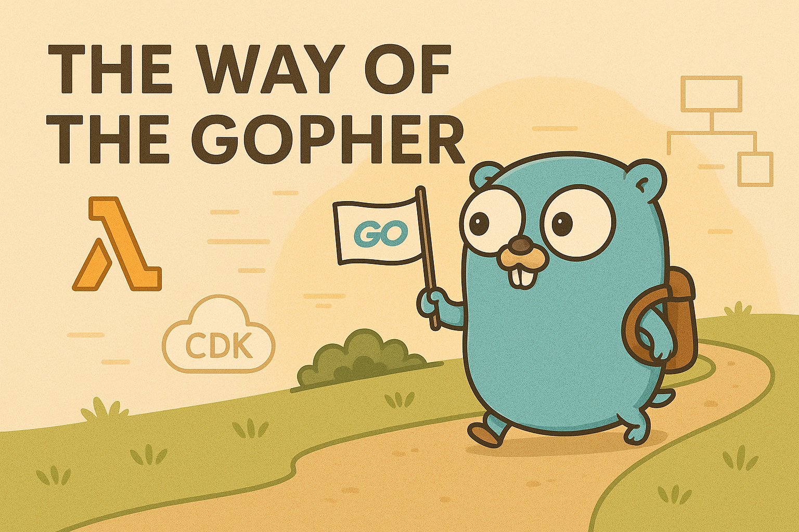
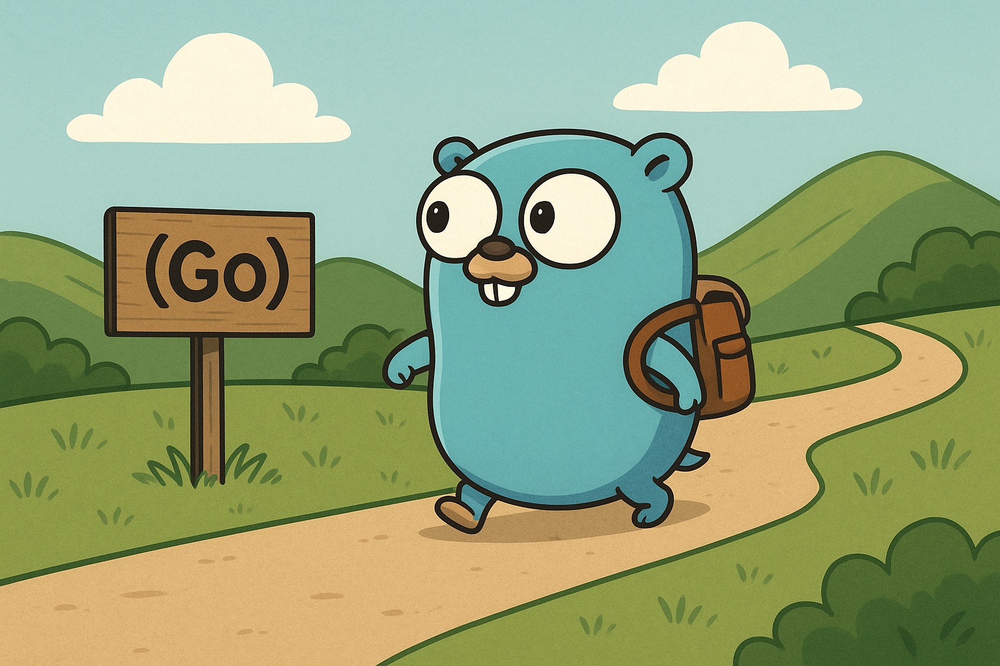

# The Way of the Gopher

  

**Learn Go gracefully — A practical journey into Go**

> From your first `fmt.Println` to deploying serverless microservices on AWS.

---

## 📘 About the Project

**The Way of the Gopher** is a book and open-source learning guide designed to teach the Go programming language with a real-world, hands-on approach. Whether you're just starting or already familiar with Go, this guide takes you through a progressive learning path focused on:

- Writing clean and idiomatic Go
- Applying best practices and SOLID principles
- Building real microservices with Clean Architecture
- Deploying serverless applications with AWS CDK

All content is available in **English** and **Spanish**.

---

## 🧩 Structure

The book is divided into 4 main parts:

### 0. Introduction
- [Introduction](part0-intoduction/00-introduction.md)

### 1. Go Fundamentals
- [Installation and setup](part1-fundamentals/01-installation-and-setup.md)
  - Installing Go (Windows, macOS, Linux)
  - Setting up your workspace
  - Introduction to go mod and dependency management
  - Writing and running your first Go program
- Basic syntax, types, structs and methods, functions
  - Variables, constants, types
  - Conditionals and loops
  - Arrays, slices, maps
  - Functions and scope
  - Defining and using structs
  - Methods and receivers
  - Pointers and references
- Interfaces and composition
  - Interfaces by example
  - Duck typing and polymorphism
  - Composition over inheritance
- Error handling
  - The Go error philosophy
  - Custom errors and errors.Is/As
  - Sentinel errors and wrapping
- Goroutines and channels
  - Goroutines: basic usage and pitfalls
  - Channels: communication and patterns
  - Select, timeouts, fan-in/fan-out
  - Contexts and cancellation

### 2. Best Practices
- Clean Code with Go
  - Naming conventions, comments
  - Readability and maintainability
  - Organizing code into packages
- Applying SOLID principles
  - Adapting SOLID to Go idioms
  - Dependency injection
  - Interfaces and boundaries
- Unit tests and mocks
  - Table-driven tests
  - Using testing and testify
  - Creating mocks manually and with tools
- Clean Architecture (for real)
  - Layers and responsibilities
  - Dependency inversion with interfaces
  - Folder structure for real projects

### 3. Go in the Cloud ☁️
- Intro to AWS CDK in TypeScript
  - CDK basics: stacks, constructs, apps
  - Synth and deploy
  - Integrating with GitHub
- Building Lambdas with Go
  - Writing AWS Lambda functions in Go
  - Deploying Lambdas with CDK
  - Environment variables and IAM roles
- Integration with API Gateway, SQS/SNS, DynamoDB, S3
  - API Gateway and Lambdas
  - DynamoDB: reads, writes, pagination
  - SQS and SNS: event-driven communication
  - S3: file upload and storage
- Basic CI/CD with GitHub Actions
  - Linting, testing, building Go projects
  - CDK deploy automation
  - Secrets management

### 4. Final Project
- Complete microservice with Go + Clean Architecture
  - Requirements and design
  - Architecture diagram
  - Technologies used
  - Use cases and domain entities
  - Input/output ports and adapters
  - Implementing workflows
- Asynchronous events, logs, error handling
  - Logs, metrics, tracing
  - Error handling and retries
- Infrastructure with CDK
  - CDK resources setup
  - Deployment pipelines
- Tests and deployments
  - Local development and testing

---

## 📖 Formats

- [Online version (coming soon)](https://example.com)
- [PDF/EPUB release](https://github.com/fsjorgeluis/the-way-of-the-gopher/releases)

---

## 🌍 Translations

The book is currently available in:

- 🇬🇧 English
- 🇪🇸 Español

We welcome contributions in other languages! See [CONTRIBUTING.md](CONTRIBUTING.md) for more info.

---

## 💬 Who This Is For

- Developers learning Go for the first time
- Engineers wanting to apply Go to real, scalable systems
- People interested in clean code, architecture, and cloud development

You’ll need:
- A computer
- [Go installed](https://golang.org/doc/install)
- Basic terminal knowledge
- Curiosity and motivation to build things

---

## 🤝 Contributing

Contributions are welcome! You can:

- Fix typos, grammar or code examples
- Suggest new topics or improvements
- Help with translations
- Submit examples or case studies

Please read our [CONTRIBUTING.md](CONTRIBUTING.md) to get started.

---

## 📣 Stay Connected

- Follow updates on [Bluesky](http://linktodev.bsky.social/)
- [Open issues or feedback](https://github.com/fsjorgeluis/the-way-of-the-gopher/issues)

---

## 🧠 License

This project is licensed under the [MIT License](LICENSE).

---

> _“The journey of a thousand lines begins with a single `go run`.”_

---

[//]: # (  )

